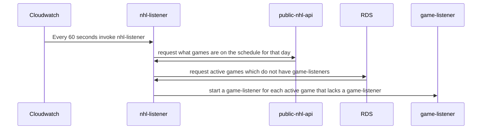
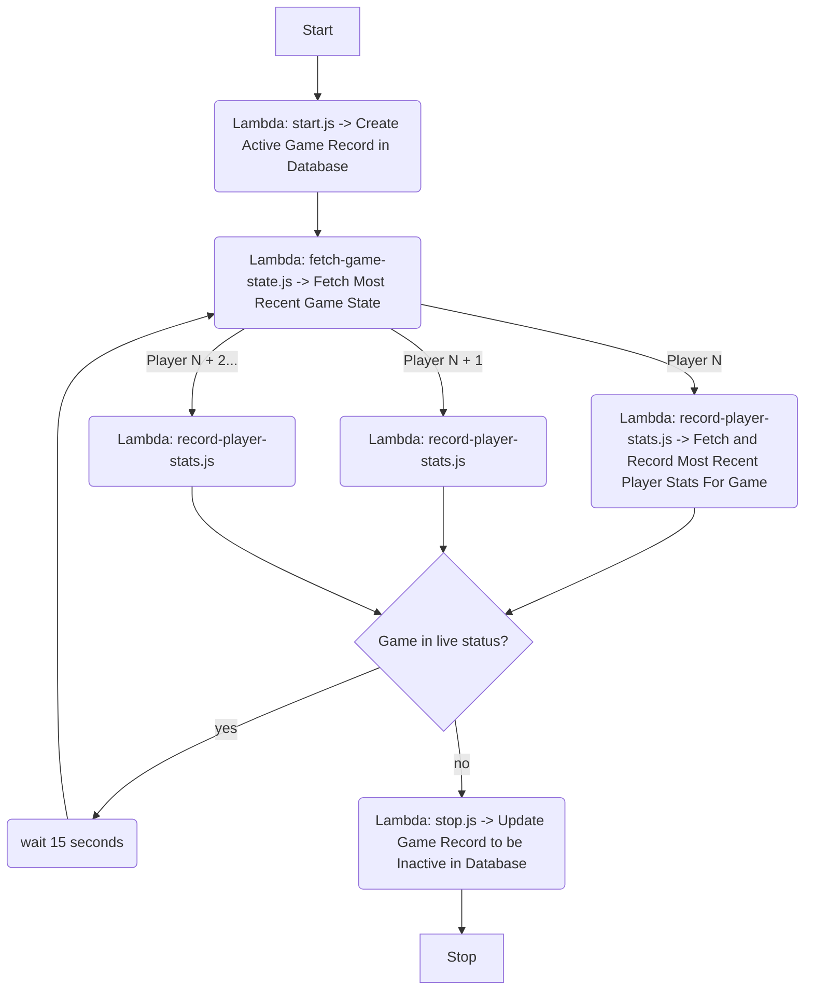

# NHL Scraper Proof of Concept

This repo attempts to show a high level example of how a live NHL game scraper could be built.

## Quick Start

This repo consists of three main parts:
 -  `nhl-listener`
 -  `game-listener`
 -  `nhl-service`

The purpose and structure of these services are explained further down in this document. I have provided simple scripts to run each service locally. These services all share models, services, and a local SQLite database. Each service assumes the user is using `yarn` and is using `node v14+`.

To Start:

run `yarn install`

Depending on the service you want to use, run `yarn start:listener` or `yarn start:stepfunction` or `yarn start:nhlservice`. Run those in order to ensure data is populated for the REST API in nhl-service.

Some utility scripts
- `yarn build` -> transpiles the app to `/dist`
- `yarn sqlite:clear` -> clears the local SQLite databases, they will be rebuilt on next start command
- `yarn test` -> runs a small suite of unit tests

## Design

This repo does not include any attempt to provision AWS environments, due to time constraints. However, each service is written to function as an [AWS Lambda](https://aws.amazon.com/lambda/) or a composition of lambdas. The code included in this repository attempts to mock remote services that would be leveraged in a production implementation. As such, the design below attampts to explain how this architecture would work if it was "properly" implemented in an AWS enviornment.

This design is intended to scale well, be cost efficient, and simple. By leveraging lambdas and step-functions, we are able to only run services when games are running, without any wasted compute time or costs.

### Architecture

This repo consists of three main parts:
 -  `nhl-listener` -> Lambda triggered on a schedule by [AWS Cloudwatch](https://aws.amazon.com/cloudwatch/). It queries the public NHL API, determines what games are live, and creates game-listeners for live games.
 -  `game-listener` -> Series of lambdas that work together in an [AWS StepFunction](https://aws.amazon.com/step-functions/). Will poll NHL API for a specific game every 15 seconds for player stats. It will write these stats to an [AWS RDS](https://aws.amazon.com/rds/) as they change. The step-function will shut itself down when the game enters a "final" state.
 -  `nhl-service` -> Lambda behind a [AWS Api-Gateway](https://aws.amazon.com/api-gateway/). The lambda wraps a [koa](https://koajs.com/) service that clients can query to get live or previously-recorded player stats.

### NHL-Listener

The NHL-Listener is represented by the `src/lambda/nhl-listener.ts` file. You can run it as a mock lambda locally by running the command: `start:listener`. You can modify the event object in `src/scripts/mock-listener.ts` to simulate different types of cloudwatch event triggers. The graphic below illustrates how this lambda would function in a production environment.

### Game-Listener

The Game-Listener is represented by all the lambda files in the `src/lambda/game-listener/` directory. You can run it as a mock lambda locally by running the command: `start:stepfunction`. You can modify the event object in `src/scripts/mock-step-function.ts` to simulate different types of event invocations. The graphic below illustrates how these lambdas would function together in a production step-function.

### NHL-Service

The NHL-Service is represented by the `src/lambda/nhl-service.ts` file. You can run it as a mock lambda service locally by running the command: `start:nhlservice`. The chart below details the route you can use to query player statistics after they are populated in the local database.

| Resource                                                | Description                                                        | Params                                        | Notes                                                                                                                                                                                                                                                                                                                  |
| :------------------------------------------------------ | :----------------------------------------------------------------- | :-------------------------------------------- | ---------------------------------------------------------------------------------------------------------------------------------------------------------------------------------------------------------------------------------------------------------------------------------------------------------------------- |
| `GET /v1/game/:externalGameId` | Returns player stats for a game that matches the ID provided. | query params: `externalPlayerId: number` | Will return all players in game by default. Can make the query more specific by speficifying any number of externalPlayerIds as query params. |

### Improvements

As noted above, this is a proof of concept. Many important features are mocked. Shortcuts are taken to illustrate an overall architecture in a limited amount of time. This should not be used as a example of good production code, but a starting point for a much more robust implementation. Notable improvements that could be added to this implementation are noted in the following list:
- Prettier and Linters -> These are standard for production codebases and ensure coding standards are applied properly across an organization.
- Handling postponed games -> There is a possibility games could be postponed. I assumed the NHL API would move postponed games to the appropriate date when querired for, but more time would be needed to properly investigate this.
- 100% unit test coverage -> There is a sampling of unit tests coverage in this repo, but it is not nearly enough for a production codebase.
- Integration tests -> Integration tests are critical for ensuring your services function as a collective whole. using open source solutions like `localstack` can ensure that you test services end-to-end on a single machine.
- Docker -> Putting applciations in Docker images and deploying those makes you applciation much more portable. It also makes artifact based deployment and roolbacks a breeze.
- Infratructure as code -> CI/CD is much easier to implement when you can define your infrastructure via configuration files bundled with the source. Terraform and serverlesss are popular solutions for this.
- Better Table Design -> The SQLite solution used in these examples is not a good example of relational database design and should not be treated as such. For starters, there should be an intermediary table to manage many-to-many relationships between Games and Players, as players can switch teams, positions, or numbers throughout the years.
- Async Messaging Queue -> This architecture is a rather closed system. Implementing a async messaging queue like AWS SQS, Kafka, or RabbitMQ would allow this solution to scale significantly better. New services could link into the message queue and process whatevr player stat information they like. The implementation detailed in this document is simpler fo illustration purposes, however.
